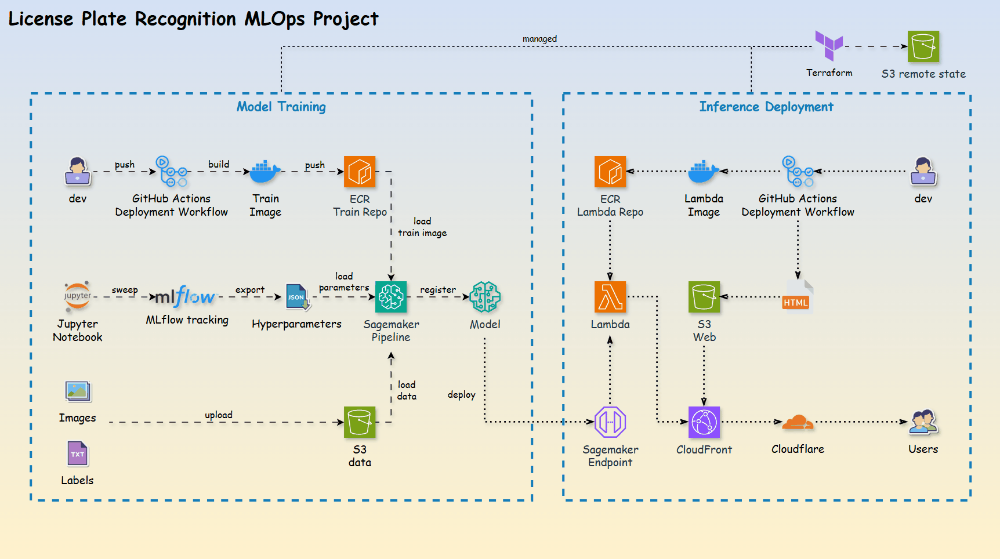
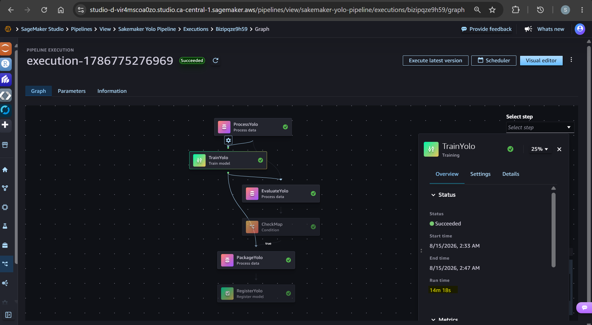
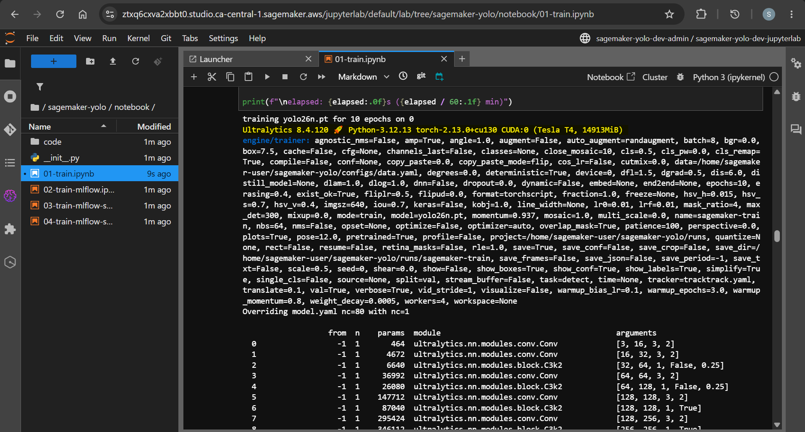
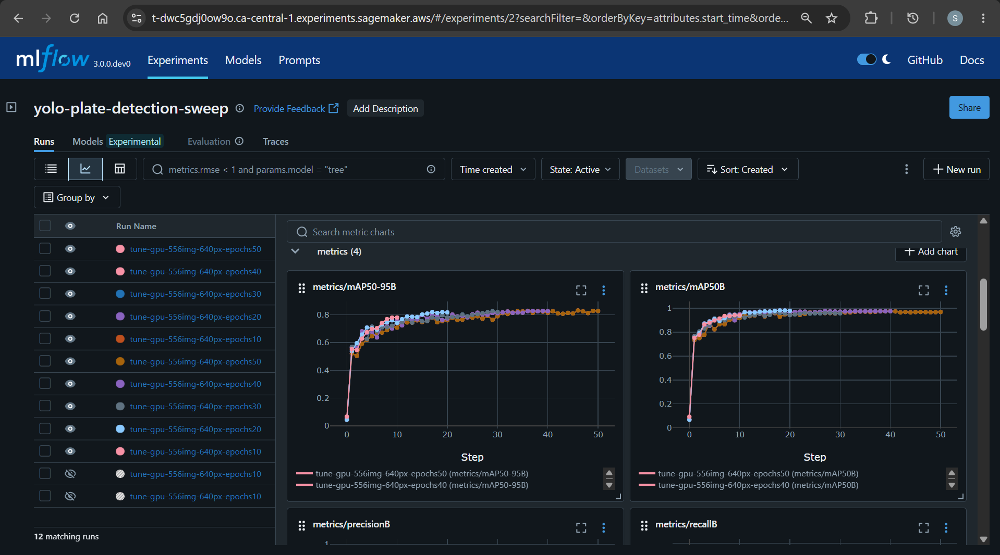
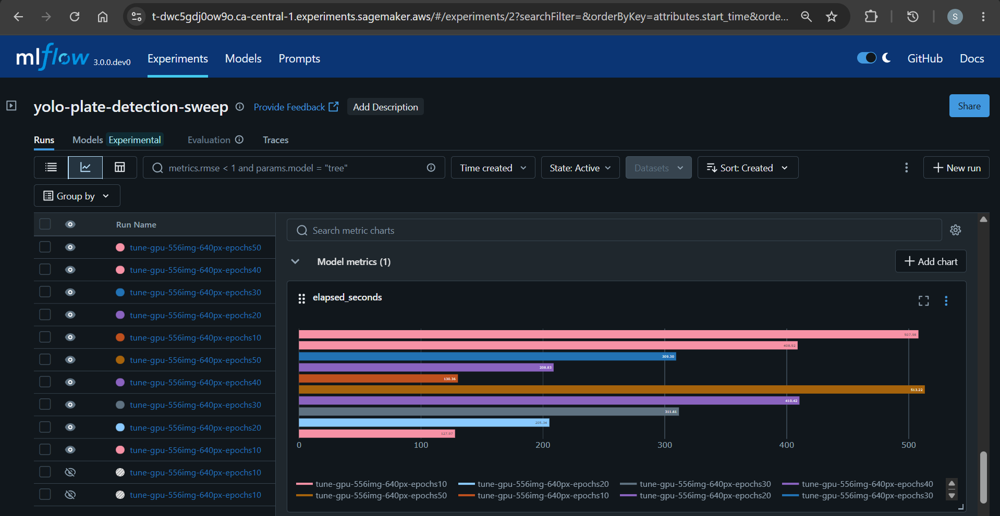
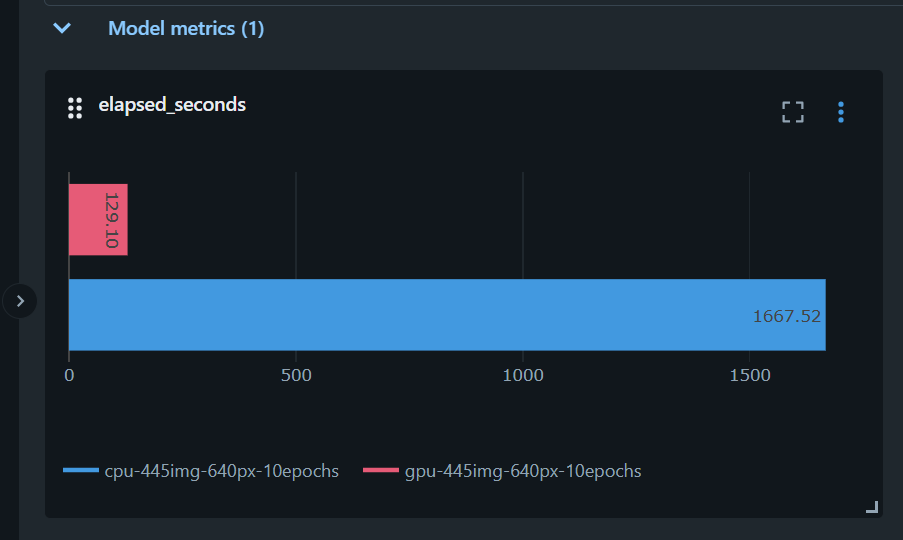
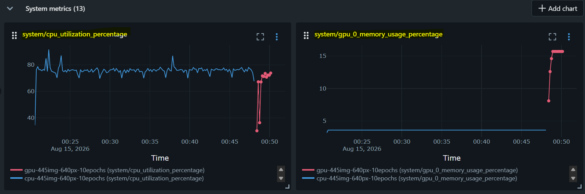

# License plate recognition with `Amazon SageMaker`

An `Amazon SageMaker` project that trains and deploys an object detection model (`YOLO`) through a full `MLOps` workflow — from labelled images to a serverless inference endpoint behind a public web app.

      

- [License plate recognition with `Amazon SageMaker`](#license-plate-recognition-with-amazon-sagemaker)
  - [Business Challenge](#business-challenge)
  - [Architecture](#architecture)
  - [Model training with `Amazon SageMaker Studio`](#model-training-with-amazon-sagemaker-studio)
    - [MLOps Pipeline](#mlops-pipeline)
    - [`Jupyter notebook` \& `MLflow`](#jupyter-notebook--mlflow)
    - [Comparison: `cpu` vs `gpu`](#comparison-cpu-vs-gpu)
  - [Inference deployment](#inference-deployment)
  - [Documentation](#documentation)

---

## Business Challenge

Computer vision models like `YOLO` are popular for object detection in manufacturing.

> However, integrating these computer vision models reliably into business applications remains a significant challenge.

This project demonstrates an end-to-end MLOps workflow by training, deploying, and serving a `YOLO` model that detects vehicle license plates.

---

## Architecture



- Repo layout

```
sagemaker-yolo/
├── .github/    GitHub Actions CI/CD workflows.
├── infra/      Terraform for every AWS resource.
├── notebook/   Jupyter notebooks.
├── train/      Pipeline definition, step scripts, training image, `hyperparams.json`.
├── inference/  Model server entry point used by the SageMaker endpoint.
├── lambda/     Lambda codes and docker file.
├── web/        Static frontend served from `S3` via `CloudFront`.
├── docs/       Step-by-step runbooks.
└── README.md   Readme documentation.
```

> OCR feature is not included — the model detects plate regions, it does not read them.

---

## Model training with `Amazon SageMaker Studio`

Train the `YOLO` model with `Amazon SageMaker Studio`.

### MLOps Pipeline

1. **Data collection** — collect images of license plates.
2. **Feature engineering** — label images.
3. **Model training and experiment tracking** — run training code with a `SageMaker pipeline` and log metrics to `MLflow`.
4. **Evaluate model** — register the model only when `mAP50-95` clears the `0.70` gate.
5. **Package and deploy** — serve the model from a `SageMaker` serverless endpoint.
6. **Integrate** the **inference endpoint** with the **web application**.

- SageMaker pipeline to automate training



---

### `Jupyter notebook` & `MLflow`

- `Jupyter notebook`: train the `YOLO` model



- `MLflow`: track training metrics



- `MLflow`: hyperparameter sweep for the best performance



---

### Comparison: `cpu` vs `gpu`

Train the same YOLO model with the same dataset and the same hyperparameters.

- Cost comparison

| Instance              | Specification | GPU | Rate per hour($) | Total min | Total cost($) |
| --------------------- | ------------- | --- | ---------------- | --------- | ------------- |
| `ml.m5.xlarge(cpu)`   | 4vCPU, 16 GiB | N/A | 0.257            | 27.8      | 0.379         |
| `ml.g4dn.xlarge(gpu)` | 4vCPU, 16 GiB | Yes | 0.818            | 2.2       | 0.029         |

The GPU instance costs ~3x more per hour but finishes ~13x faster, so the run is roughly **13x cheaper** overall.

- train time
  - train with cpu: 27.8m
  - train with gpu: 2.2m



- resource consumption
  - train with cpu (blue): ~75% cpu
  - train with gpu (red): ~75% cpu, gpu: ~15%



Low GPU utilisation indicates the run is input-bound rather than compute-bound — headroom for a larger batch or faster data loading.

---

## Inference deployment

1. **Promote the model** — approve a version in the `sagemaker-yolo` model package group.
2. **Serve** the approved model from a `SageMaker` serverless endpoint, so idle time costs nothing.
3. **Integrate** the endpoint with the web application through the `Lambda` proxy behind `CloudFront`.

---

## Documentation

- [Infrastructure-as-code via Terraform](./docs/01-infra.md)
- [Train `YOLO` model with `Amazon Sagemaker Studio`](./docs/02-train.md)
- [MLOps pipeline](./docs/03-pipeline.md)
- [ML application deployment](./docs/04-deploy.md)
- [CI/CD pipeline](./docs/05-cicd.md)
