# Sagemaker yolo - Training

[Back](../README.md)

- [Sagemaker yolo - Training](#sagemaker-yolo---training)
  - [Upload raw data](#upload-raw-data)
  - [Enable experiment](#enable-experiment)
    - [Notebook](#notebook)
    - [MLflow sweep](#mlflow-sweep)
    - [Device GPU](#device-gpu)
  - [Comparison: CPU vs GPU](#comparison-cpu-vs-gpu)

---

## Upload raw data

```sh
# get sync command
terraform -chdir=infra output -raw s3_sync_command
# aws s3 sync data/raw s3://sagemaker-yolo-dev-up68ac/raw-data/

# sync raw data
aws s3 sync data/raw s3://sagemaker-yolo-dev-up68ac/raw-data/

# list
aws s3 ls s3://sagemaker-yolo-dev-up68ac/raw-data/ --recursive

# remove a folder
aws s3 rm s3://sagemaker-yolo-dev-up68ac/raw-data/ --recursive
```

---

## Enable experiment

- experiment environment is controled by variable `enable_experiment`

```sh
# apply
terraform -chdir=infra apply -auto-approve -var="enable_experiment=true"

# studio domain login
terraform -chdir=infra output -raw studio_login_command
# Notebook
terraform -chdir=infra output -raw notebook_url

# MLflow
aws sagemaker create-presigned-mlflow-tracking-server-url \
  --tracking-server-name sagemaker-yolo-dev \
  --region ca-central-1 --query AuthorizedUrl --output text
```

---

### Notebook

- Train with cpu


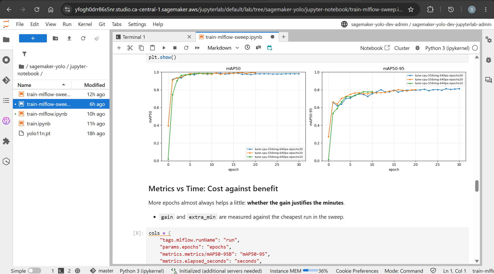

- val: accept model

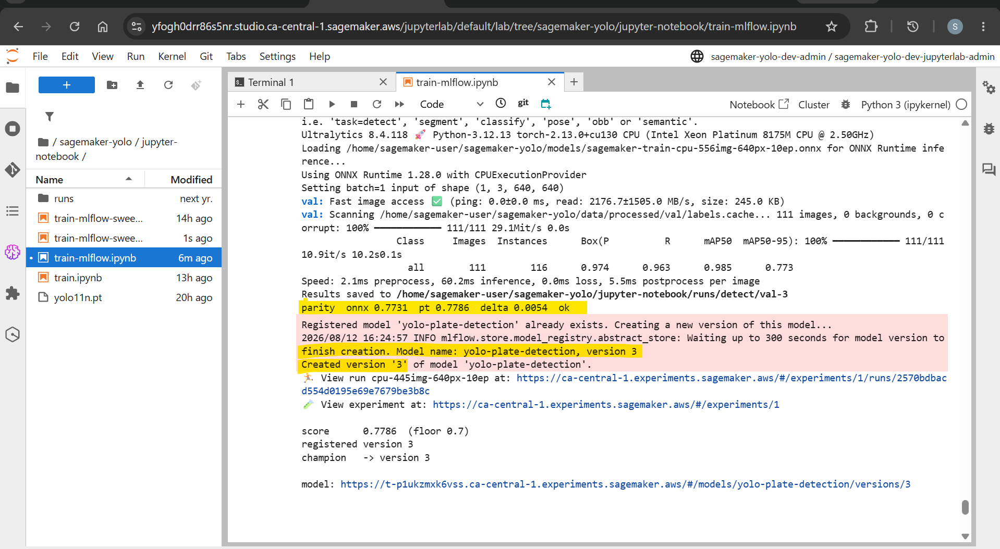

- val: reject model

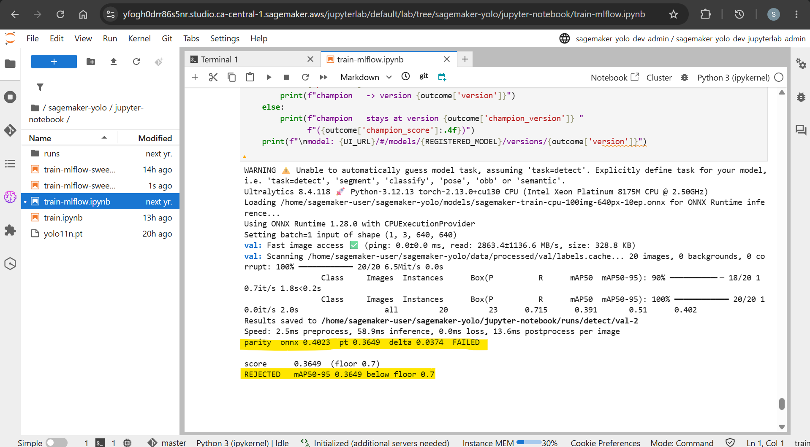

---

### MLflow sweep

- Experiments with mlflow server

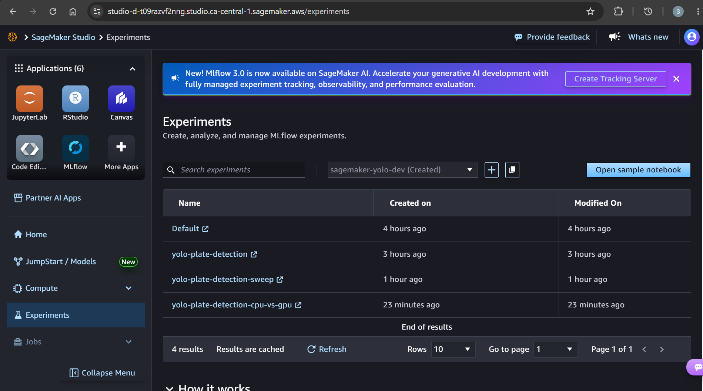

- learning rate

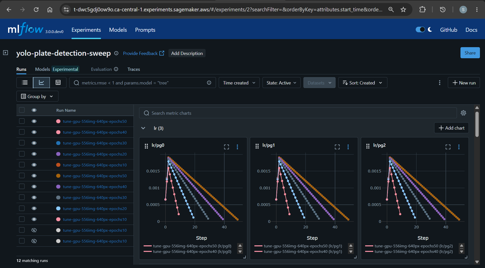

- loss

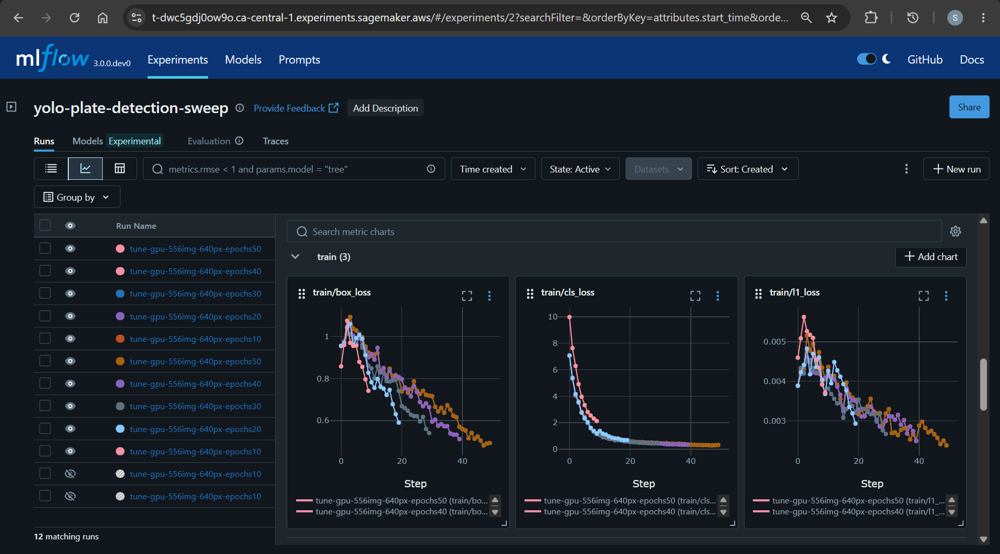

- mPA


- precision & recall

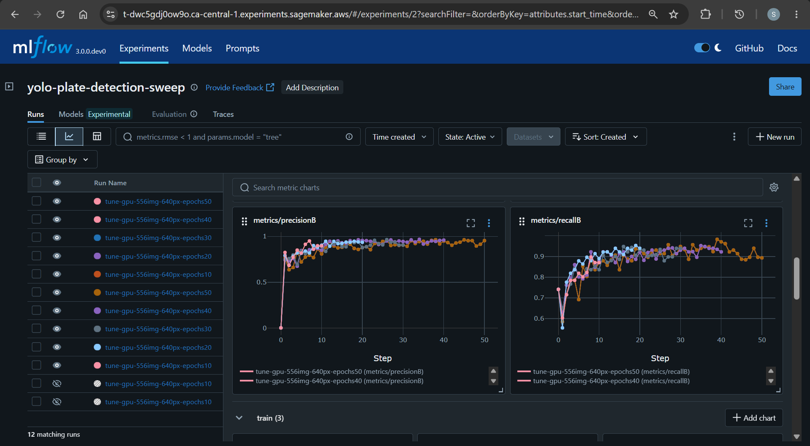

- val

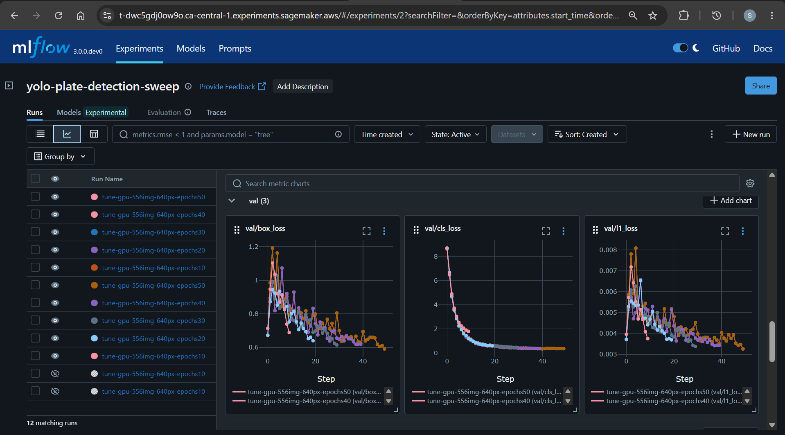

- train time


---

### Device GPU

- gpu info

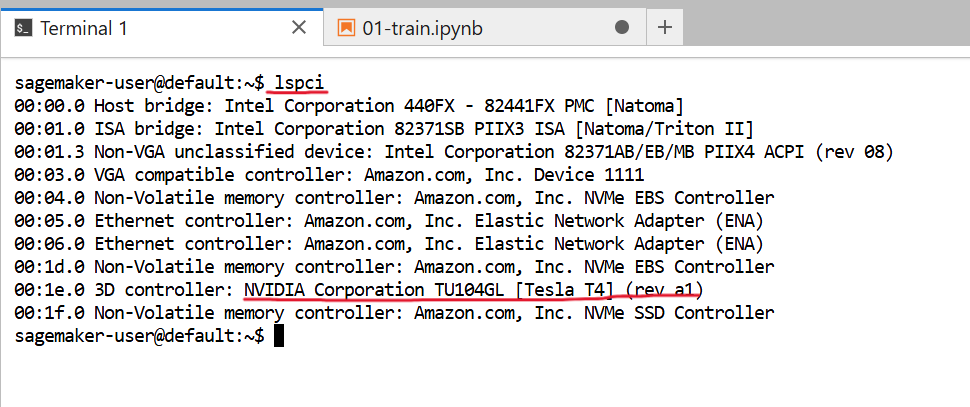

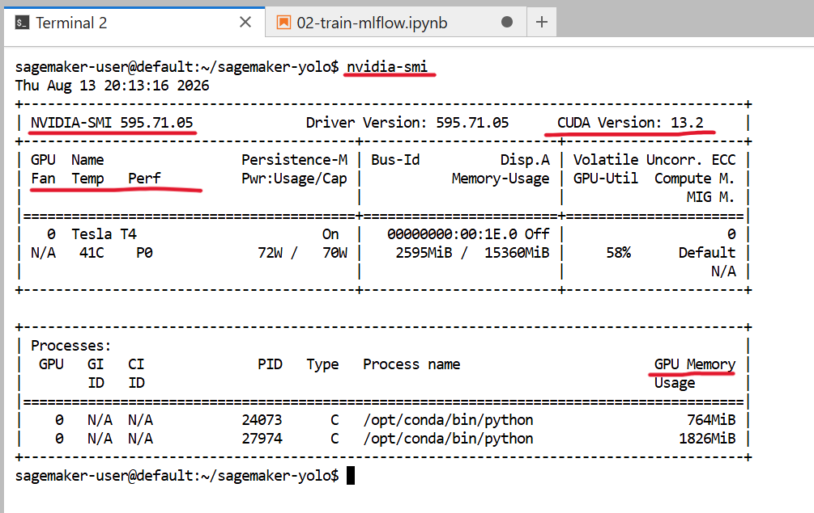

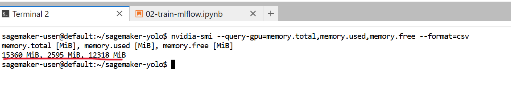

---

- train with cpu

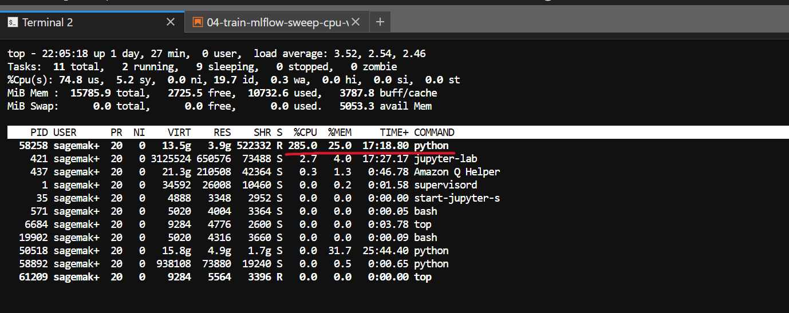

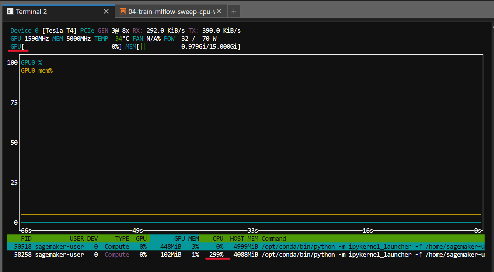

- train with gpu

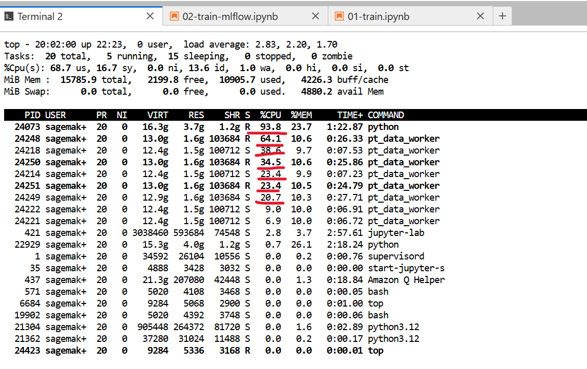

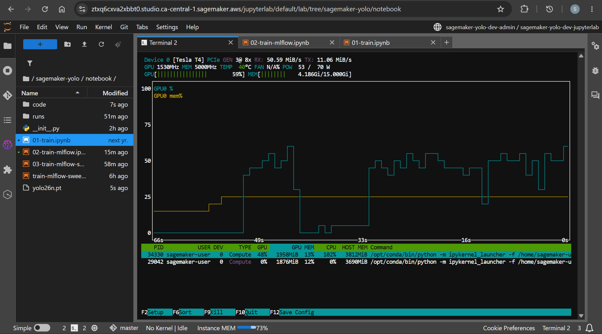

---

## Comparison: CPU vs GPU

- epoch: 10

| instance              | Specification | rate_per_hour($) | total_min | total_usd($) |
| --------------------- | ------------- | ---------------- | --------- | ------------ |
| `ml.m5.xlarge(CPU)`   | 4vCPU, 16 GiB | 0.257            | 27.8      | 0.379        |
| `ml.g4dn.xlarge(GPU)` | 4vCPU, 16 GiB | 0.818            | 2.2       | 0.029        |

- train time


- cpu% vs gpu%


