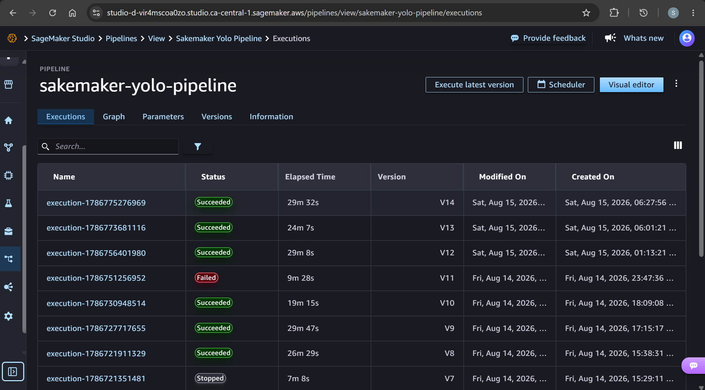

# Sagemaker yolo - Pipeline

[Back](../README.md)

- [Sagemaker yolo - Pipeline](#sagemaker-yolo---pipeline)
  - [Hyperparameters design](#hyperparameters-design)
  - [Train image](#train-image)
  - [Pipeline](#pipeline)
  - [Debug](#debug)

---

## Hyperparameters design

The notebook's **Export hyperparameters** cell writes `train/hyperparams.json`.
Commit it to git.

`train/hyperparams.json` is the contract between the sweep and the pipeline:

```json
{
  "schema": 1,
  "hyperparameters": { "epochs": 50, "imgsz": 640, "batch": 8, "seed": 0 },
  "provenance": {
    "run_id": "ed580a66...",
    "metric": "mAP50-95",
    "value": 0.8276
  }
}
```

---

## Train image

Build. The base is a private AWS registry

```sh
# login to the DLC registry
aws ecr get-login-password --region ca-central-1 | docker login --username AWS --password-stdin 763104351884.dkr.ecr.ca-central-1.amazonaws.com

# build
cd train/
docker build -t sagemaker-yolo-train .

# tag
docker tag sagemaker-yolo-train:latest 099139718958.dkr.ecr.ca-central-1.amazonaws.com/sagemaker-yolo-train:latest

# push
docker push 099139718958.dkr.ecr.ca-central-1.amazonaws.com/sagemaker-yolo-train:latest
```

---

## Pipeline

```sh
# confirm raw data
aws s3 ls s3://sagemaker-yolo-dev-up68ac/raw-data/ --summarize

# get execution role and bucket
terraform -chdir=infra output -raw studio_domain_role_arn
# arn:aws:iam::099139718958:role/sagemaker-yolo-dev-sagemaker-execution-role
terraform -chdir=infra output -raw s3_bucket_name
# sagemaker-yolo-dev-up68ac
terraform -chdir=infra output -raw ecr_train_repo
# 099139718958.dkr.ecr.ca-central-1.amazonaws.com/sagemaker-yolo-train

# upsert + run the pipeline
cd train/
python pipeline.py --role-arn arn:aws:iam::099139718958:role/sagemaker-yolo-dev-sagemaker-execution-role --bucket sagemaker-yolo-dev-up68ac --train-image 099139718958.dkr.ecr.ca-central-1.amazonaws.com/sagemaker-yolo-train
```




---

## Debug

```sh
# search for image
aws ecr describe-images --region ca-central-1 --registry-id 763104351884 --repository-name pytorch-training --query "imageDetails[].imageTags[]" --output text
# 2.6-gpu-py312
# │   │   │
# │   │   └── Python 3.12
# │   └────── GPU image
# └────────── PyTorch 2.6

# Check the split
aws s3 ls s3://sagemaker-yolo-dev-up68ac/train-pipeline/split/ --recursive --summarize

# confirm/data.yaml
aws s3 cp s3://sagemaker-yolo-dev-up68ac/train-pipeline/config/data.yaml -

# Clear the outputs
aws s3 rm s3://sagemaker-yolo-dev-up68ac/train-pipeline/ --recursive

# check log: ProcessingJobs
aws logs tail /aws/sagemaker/ProcessingJobs --follow
```
