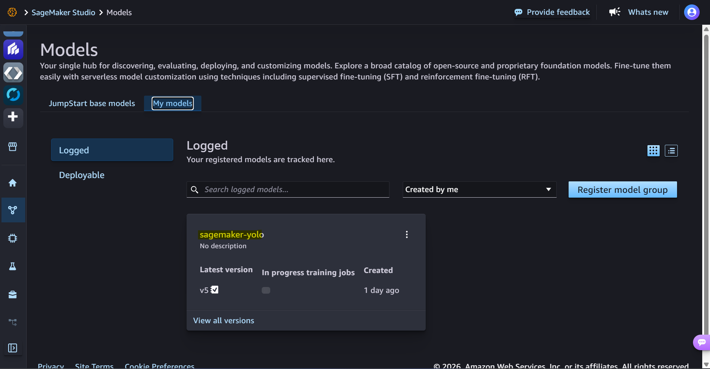
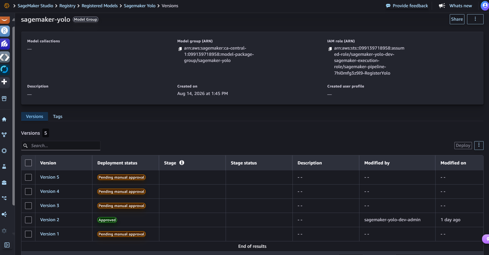

# Sagemaker yolo - app deployment

[Back](../README.md)

- [Sagemaker yolo - app deployment](#sagemaker-yolo---app-deployment)
  - [Promote model](#promote-model)
  - [Dockerfile](#dockerfile)
    - [Local app (no container)](#local-app-no-container)
    - [Create ECR](#create-ecr)
    - [Build](#build)
  - [Push to ECR](#push-to-ecr)
  - [Apply](#apply)
  - [Deploy Webapp](#deploy-webapp)

---

## Promote model

```sh
# list model
aws sagemaker list-model-packages --model-package-group-name "sagemaker-yolo" --query "ModelPackageSummaryList[*].[ModelPackageArn, ModelPackageVersion, ModelApprovalStatus]" --output table
# --------------------------------------------------------------------------------------------------------------
# |                                              ListModelPackages                                             |
# +-----------------------------------------------------------------------------+----+-------------------------+
# |  arn:aws:sagemaker:ca-central-1:099139718958:model-package/sagemaker-yolo/5 |  5 |  PendingManualApproval  |
# |  arn:aws:sagemaker:ca-central-1:099139718958:model-package/sagemaker-yolo/4 |  4 |  PendingManualApproval  |
# |  arn:aws:sagemaker:ca-central-1:099139718958:model-package/sagemaker-yolo/3 |  3 |  PendingManualApproval  |
# |  arn:aws:sagemaker:ca-central-1:099139718958:model-package/sagemaker-yolo/2 |  2 |  PendingManualApproval  |
# |  arn:aws:sagemaker:ca-central-1:099139718958:model-package/sagemaker-yolo/1 |  1 |  PendingManualApproval  |
# +-----------------------------------------------------------------------------+----+-------------------------+

# approve to promote the model
aws sagemaker update-model-package --model-package-arn arn:aws:sagemaker:ca-central-1:099139718958:model-package/sagemaker-yolo/2 --model-approval-status Approved
# {
#     "ModelPackageArn": "arn:aws:sagemaker:ca-central-1:099139718958:model-package/sagemaker-yolo/2"
# }

```

---

## Dockerfile

### Local app (no container)

```sh
# apps dependencies
pip install -r requirements.txt
# test dependencies
pip install httpx2

cd lambda/app
python -m test_local
# GET readiness                200  {"name": "yolo-car-plate", "classes": ["car_plate"], "imgsz": 640}
# POST no body                 400  {"detail": "expected instances[0].image.b64"}
# POST bad shape               400  {"detail": "expected instances[0].image.b64"}
# POST predict conf=0.25       200  {"predictions": [{"detections": [{"box": {"x1": 183.38, "y1": 158.1, "x2": 291.74, "y2": 214.82}, "class_name": "car_plate", "class_id": 0, "confidence": 0.7939}], "count": 1}]}
# POST predict conf=0.99       200  {"predictions": [{"detections": [], "count": 0}]}
# mangum GET readiness         200  {"name": "yolo-car-plate", "classes": ["car_plate"], "imgsz": 640}

# all assertions passed
```

---

### Create ECR

```sh
# create repo
terraform -chdir=infra apply -target=aws_ecr_repository.lambda

terraform -chdir=infra output -raw ecr_lambda_repo
# 099139718958.dkr.ecr.ca-central-1.amazonaws.com/sagemaker-yolo-lambda
```

---

### Build

```sh
docker build -t yolo-lambda lambda/

docker images yolo-lambda --format "{{.Size}}"
# 826MB

```

## Push to ECR

```sh
# login
aws ecr get-login-password --region ca-central-1 | docker login --username AWS --password-stdin 099139718958.dkr.ecr.ca-central-1.amazonaws.com

# build + push:
docker buildx build --platform linux/amd64 --provenance=false --sbom=false --output "type=image,name=099139718958.dkr.ecr.ca-central-1.amazonaws.com/sagemaker-yolo-lambda:latest,oci-mediatypes=false,push=true" ./lambda/

# Confirm the media type before applying
aws ecr batch-get-image --repository-name sagemaker-yolo-lambda --region ca-central-1 --image-ids imageTag=latest   --query "images[0].imageManifest" --output text
# {
#   "schemaVersion": 2,
#   "mediaType": "application/vnd.docker.distribution.manifest.v2+json",
# ...
```

---

## Apply

```sh
# deploy
terraform -chdir=infra apply -auto-approve -var="enable_deploy=true"

# readiness command
terraform -chdir=infra output -raw web_readiness_command
# curl https://yolo.arguswatcher.net/v1/models/yolo-car-plate

curl https://yolo.arguswatcher.net/v1/models/yolo-car-plate
# {"name":"yolo-car-plate","classes":["car_plate"],"imgsz":640}
```

- registered model





---

## Deploy Webapp

```sh

```