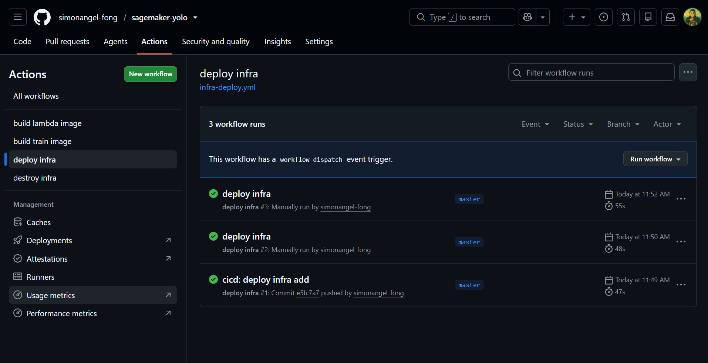

# Sagemaker yolo - CI/CD pipeline

[Back](../README.md)

- [Sagemaker yolo - CI/CD pipeline](#sagemaker-yolo---cicd-pipeline)
  - [CD/CD pipeline](#cdcd-pipeline)
    - [Build lambda image workflow](#build-lambda-image-workflow)
    - [Build train image workflow](#build-train-image-workflow)
    - [Deploy infrastructure workflow](#deploy-infrastructure-workflow)
    - [Destroy infrastructure workflow](#destroy-infrastructure-workflow)
    - [Deploy webapp workflow](#deploy-webapp-workflow)
  - [GitHub Action variables and secrets](#github-action-variables-and-secrets)

---

## CD/CD pipeline

### Build lambda image workflow

- name: build lambda image
- Trigger:
  - workflow
  - lambda/
  - manual
- key steps:
  - Login AWS
  - Build and push
  - Summary report

---

### Build train image workflow

- name: build train image
- Trigger:
  - workflow
  - train/
  - manual
- key steps:
  - Login AWS
  - Build and push
  - Summary report

---

### Deploy infrastructure workflow

- name: infrastructure deploy
- Trigger:
  - infra/
  - manual
- key steps:
  - Setup terraform
  - Setup aws
  - Terraform init
  - Terraform fmt
  - Terraform validate
  - Terraform plan
  - Terraform apply
  - Summary report

---

### Destroy infrastructure workflow

- name: infrastructure destroy
- Trigger:
  - manual
- key steps:
  - Setup terraform
  - Setup aws
  - Terraform init
  - Terraform fmt
  - Terraform validate
  - Terraform plan
  - Terraform destroy
  - Summary report

---

### Deploy webapp workflow

- name: deploy webapp
- Trigger:
  - web/
  - manual
- key steps:
  - Setup terraform
  - Setup aws
  - Terraform init
  - Terraform plan (targeted at `aws_s3_object.web`)
  - Terraform apply
  - Invalidate CloudFront
  - Summary report

Pushes plan only; `apply` requires a manual dispatch with `action: apply`, the
same gate as the infrastructure workflow. The plan is targeted so a webapp
deploy never applies unrelated infrastructure drift. The invalidation runs only
when an apply actually changed objects, and waits for completion so a green run
means the edges are serving the new files.

---

## GitHub Action variables and secrets

- Environment: dev

| Variables | Description |
| --------- | ----------- |
| ENV       | dev         |

| Variables                 | Description                        |
| ------------------------- | ---------------------------------- |
| AWS_GH_OIDC_ROLE_ARN      | AWS GitHub OIDC role arn           |
| AWS_GH_TERRAFORM_ROLE_ARN | AWS GitHub OIDC terraform role arn |
| REPO_OWNER_ID             | GitHub owner id                    |
| REPO_ID                   | GitHub repo id                     |
| AWS_REGION                | AWS region                         |
| TF_STATE_BUCKET           | Terraform state bucket             |
| VPC_ID                    | VPC id                             |
| PUBLIC_SUBNET_ID          | Public subnet id                   |
| ENABLE_DEPLOY             | whteher enable deployment          |
| ENABLE_EXPERIMENT         | whteher enable experiment          |
| ECR_TRAIN_URL             | ECR url for train image            |
| ECR_LAMBDA_URL            | ECR url for lambda image           |
| ALERT_EMAIL               | Alert email                        |

| Secrets              | Description          |
| -------------------- | -------------------- |
| CLOUDFLARE_API_TOKEN | Cloudflare api token |
| CLOUDFLARE_ZONE_ID   | Cloudflare zone id   |

```sh
# gh oidc role
terraform -chdir=infra output -raw github_actions_oidc_role_arn
gh secret set AWS_GH_OIDC_ROLE_ARN --body "arn:aws:iam::099139718958:role/sagemaker-yolo-dev-github-actions-oidc-role"

# gh terraform role
terraform -chdir=infra output -raw github_terraform_role_arn
gh secret set AWS_GH_TERRAFORM_ROLE_ARN --body "arn:aws:iam::099139718958:role/sagemaker-yolo-dev-github-terraform-role"

# ecr train repo
terraform -chdir=infra output -raw ecr_train_repo
# 099139718958.dkr.ecr.ca-central-1.amazonaws.com/sagemaker-yolo-train
gh variable set ECR_TRAIN_URL --body "099139718958.dkr.ecr.ca-central-1.amazonaws.com/sagemaker-yolo-train"

# ecr lambda repo
terraform -chdir=infra output -raw ecr_lambda_repo
# 099139718958.dkr.ecr.ca-central-1.amazonaws.com/sagemaker-yolo-lambda
gh variable set ECR_LAMBDA_URL --body "099139718958.dkr.ecr.ca-central-1.amazonaws.com/sagemaker-yolo-lambda"

# environment
gh variable set ENV --env dev --body "dev"

# set variables
gh variable set REPO_OWNER_ID --body "<repo_owner_id>"
gh variable set REPO_ID --body "<repo_id>"
gh variable set AWS_REGION --body "ca-central-1"
gh variable set TF_STATE_BUCKET --body "<remote_state_bucket>"
gh variable set VPC_ID --body "<vpc_id>"
gh variable set PUBLIC_SUBNET_ID --body "<subnect_id>"
gh variable set ENABLE_DEPLOY --body "false"
gh variable set ENABLE_EXPERIMENT --body "false"
gh variable set ALERT_EMAIL --body "tech.arguswatcher@gmail.com"

gh secret set CLOUDFLARE_API_TOKEN --body "<api_token>"
gh secret set CLOUDFLARE_ZONE_ID --body "<zone_id>"

```


